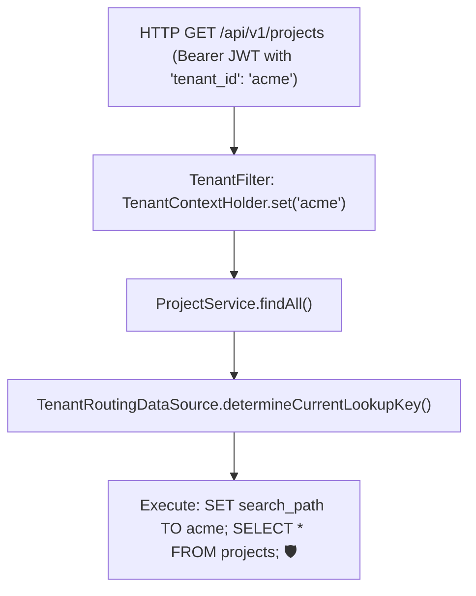

# Project 09: Enterprise Multi-Tenant SaaS Platform

> **Project Code**: `PRJ-09`
> **Level**: Senior / Staff
> **Primary Technology**: Java 21 LTS | Schema-per-Tenant | AbstractRoutingDataSource | Hibernate Multi-Tenancy

---

## 🏗️ Architecture & Domain Model
A B2B SaaS platform supporting isolated schemas per enterprise customer with JWT tenant claim extraction, dynamic schema migrations via Flyway, and zero cross-tenant data contamination.

---

## 🔑 Key Engineering Highlights
1. **Dynamic Schema Routing**: `AbstractRoutingDataSource` with `ThreadLocal` context extraction in a Servlet Filter.
2. **Automated Tenant Onboarding**: Dynamic schema creation and Flyway migration execution during new tenant registration.

---

## 💬 Interview Talking Points
- *Question*: "How do you guarantee a tenant's data is never visible to another tenant?"
- *Answer*: "We isolate customer data using a Schema-per-Tenant topology. Incoming JWT tokens contain cryptographically signed tenant claims. A servlet filter validates the token, extracts the tenant ID, and binds it to a `ThreadLocal` context. When obtaining a JDBC connection, `TenantRoutingDataSource` routes to the appropriate schema or sets the database session `search_path`, making cross-tenant queries physically impossible at the database engine level."
