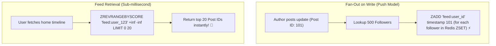

# Project 10: Scalable Activity & Content Feed (Redis Sorted Sets)

> **Project Code**: `PRJ-10`
> **Level**: Senior / SDE2
> **Primary Technology**: Java 21 LTS | Redis Sorted Sets (ZSET) | Fan-Out on Write vs Fan-Out on Read

---

## 🏗️ Architecture & Domain Model
A social media activity timeline and notification feed capable of delivering reverse-chronological user feeds in sub-2ms latency using Redis Sorted Sets (`ZREVRANGEBYSCORE`).

---

## 🔑 Key Engineering Highlights
1. **Redis ZSET Indexing**: Using epoch millisecond timestamps as ZSET scores for instant reverse-chronological pagination.
2. **Hybrid Fan-Out Strategy**: Fan-out on write for regular users (< 25,000 followers) combined with fan-out on read for celebrity accounts (> 1,000,000 followers) preventing write bottlenecks.

---

## 💬 Interview Talking Points
- *Question*: "What is the 'Celebrity Problem' in feed architecture and how do you solve it?"
- *Answer*: "The Celebrity Problem occurs when a user with 50 million followers posts an update: Fan-out on write requires 50 million Redis `ZADD` operations, overwhelming the write pipeline. We solve this with a **Hybrid Fan-Out Architecture**: normal user posts are fanned out on write into follower feeds, whereas celebrity posts are stored only in the celebrity's outbox. When a user requests their feed, the system fetches their Redis feed and merges it at query time with the posts from celebrities they follow."
