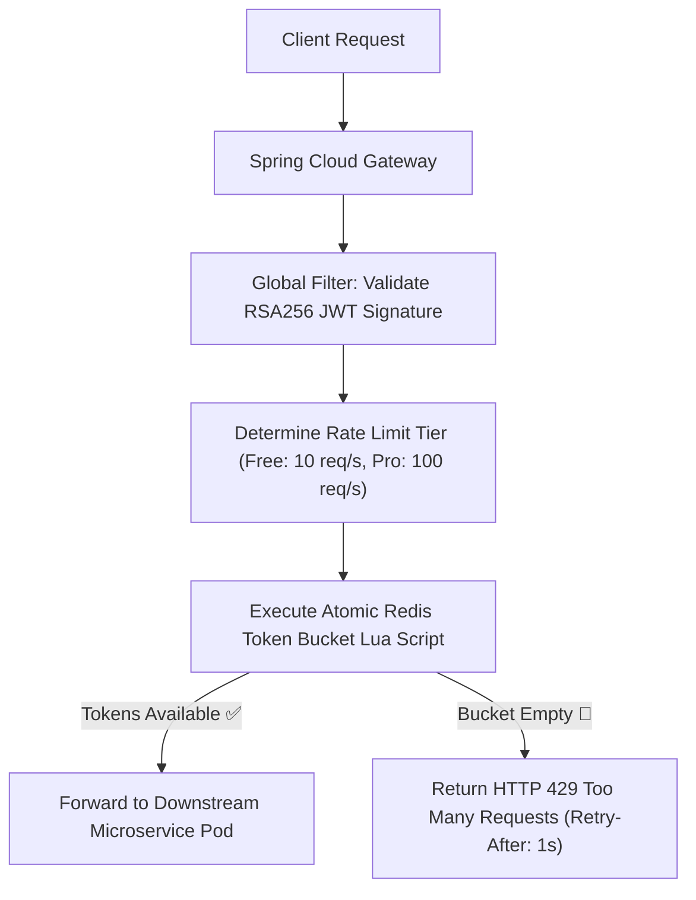

# Project 11: Enterprise API Gateway with Distributed Token Bucket Rate Limiting

> **Project Code**: `PRJ-11`
> **Level**: Senior / Staff
> **Primary Technology**: Java 21 LTS | Spring Cloud Gateway | Redis Lua Scripting | JWT Authorization

---

## 🏗️ Architecture & Domain Model
A high-throughput edge API gateway built on Spring Cloud Gateway (Netty non-blocking), validating JWT claims, stripping sensitive headers, and enforcing tiered Token Bucket rate limiting via atomic Redis Lua scripts.

---

## 🔑 Key Engineering Highlights
1. **Atomic Redis Token Bucket**: Evaluating token consumption and refill timestamps in a single atomic Lua script.
2. **Tiered Dynamic Limits**: Resolving rate limits based on user tier claims in JWT (`plan: enterprise` vs `plan: starter`).

---

## 💬 Interview Talking Points
- *Question*: "Why is rate limiting evaluated via Redis Lua scripts rather than standard Redis GET and SET commands?"
- *Answer*: "Checking current token balance and writing the updated balance requires two separate commands. In high-concurrency environments with thousands of requests per second, race conditions occur between the `GET` and `SET`, causing multiple requests to pass concurrently and exceeding the rate limit. A Redis Lua script executes atomically in a single event-loop cycle on the Redis master, guaranteeing thread-safe token decrements with zero race conditions."
