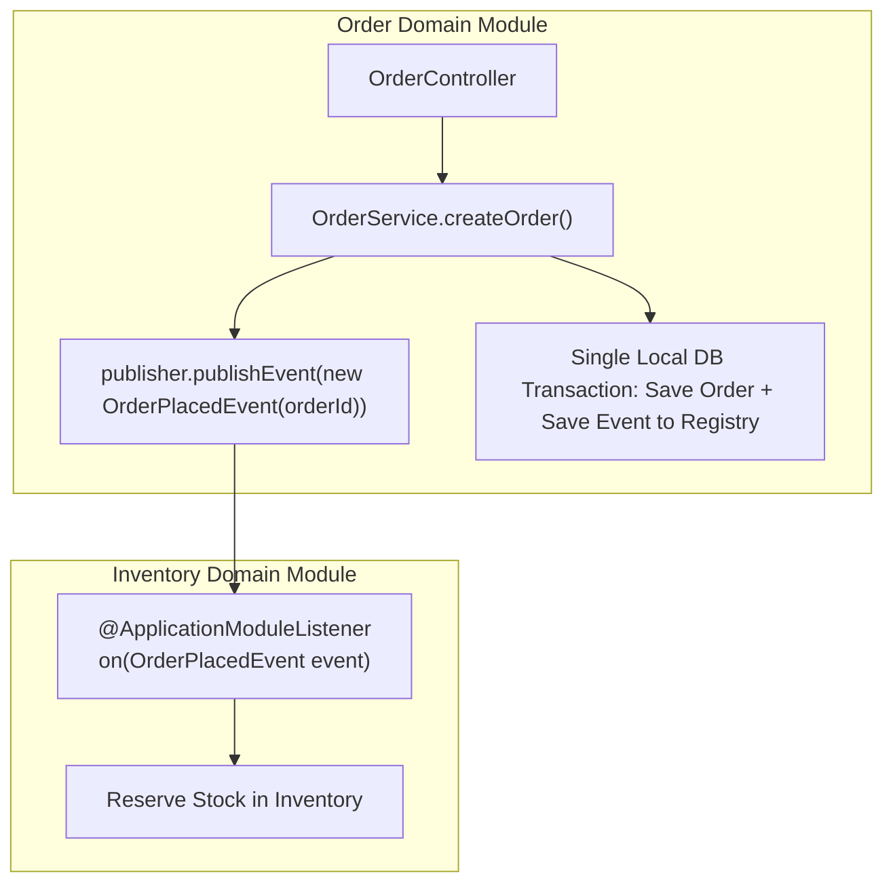

# Project 12: Event-Driven Modular Monolith with Spring Modulith

> **Project Code**: `PRJ-12`
> **Level**: Senior / Staff
> **Primary Technology**: Java 21 LTS | Spring Modulith 1.3 | Event Publication Registry | PostgreSQL

---

## 🏗️ Architecture & Domain Model
A production-grade Modular Monolith enforcing package boundaries at build time, using transactional domain events with an in-memory Event Publication Registry backed by PostgreSQL to ensure zero event loss without requiring external message brokers.

---

## 🔑 Key Engineering Highlights
1. **Spring Modulith Verification**: `ApplicationModules.of(Application.class).verify()` enforcing architectural boundaries in unit tests.
2. **Event Publication Registry**: Persisting domain events into an outbox table within the same transaction as the domain entity, guaranteeing At-Least-Once delivery to listeners even if the JVM crashes mid-flight.

---

## 💬 Interview Talking Points
- *Question*: "How does Spring Modulith achieve the loose coupling of microservices within a single JVM application?"
- *Answer*: "Spring Modulith uses domain packages as architectural boundaries and replaces direct service-to-service method calls with transactional domain events (`@ApplicationModuleListener`). Modules interact exclusively through public APIs or asynchronous in-memory events backed by an Event Publication Registry. This provides the decoupling and modularity of microservices while preserving local ACID transactions, instant refactoring, and zero network serialization overhead."
