# Cross-Repository Architectural Ecosystem Map

> **Repository**: `spring-boot-interview-preparation`
> **Position in Ecosystem**: Pillar 4 of 4 (Spring Framework, Spring Boot & Production Enterprise Backend Engineering)

---

## 🌉 The Four-Repository Architecture

This repository is designed as part of a cohesive four-repository engineering mastery ecosystem. Primitives are never unnecessarily duplicated; rather, they are cross-linked, extended, and applied to real-world production Spring Boot architectures:

```mermaid
flowchart LR
    subgraph JavaRepo["1. java-interview-preparation"]
        J1["Language & Collections"]
        J2["JVM / Memory & GC"]
        J3["Concurrency & Virtual Threads"]
    end

    subgraph BackendRepo["2. backend-engineering"]
        B1["REST / HTTP / Sockets"]
        B2["Databases & Caching Theory"]
        B3["Kafka / Messaging Theory"]
        B4["Resilience & Observability"]
    end

    subgraph SysDesignRepo["3. system-design-interview"]
        S1["Distributed Architecture"]
        S2["NFRs & Capacity Math"]
        S3["Enterprise Case Studies"]
    end

    subgraph SpringRepo["4. spring-boot-interview-preparation (THIS REPOSITORY)"]
        SP1["IoC / DI / Bean Lifecycle"]
        SP2["Spring MVC / DispatcherServlet"]
        SP3["Spring Data / JPA / Hibernate / Transactions"]
        SP4["Spring Security & OAuth2"]
        SP5["Spring Kafka & Redis"]
        SP6["Testing / Actuator / Performance Tuning"]
    end

    JavaRepo --> BackendRepo
    BackendRepo --> SpringRepo
    SpringRepo --> SysDesignRepo
```

---

## 🗺️ Domain Mapping & Boundary Matrix

| Spring Concept | Underlying Domain Prerequisite | Primary Owner Repo | Spring-Specific Focus (This Repo) |
|---|---|---|---|
| **Spring IoC & DI** | OOP, SOLID, Reflection, Polymorphism | `java-interview-preparation` | `ApplicationContext`, `BeanDefinition`, lifecycle callbacks, `@ConfigurationProperties`, constructor injection mechanics. |
| **Spring MVC & REST** | HTTP/1.1, HTTP/2, REST verbs, Status codes | `backend-engineering` | `DispatcherServlet`, `HandlerMapping`, `HandlerAdapter`, `HttpMessageConverter`, `@ControllerAdvice`, Problem Details. |
| **Spring JDBC & HikariCP** | SQL syntax, connection pools, socket timeouts | `backend-engineering` | `JdbcTemplate`, `DataSource` management, HikariCP pool sizing algorithms, batch updates, generated key retrieval. |
| **Spring Data JPA & Hibernate** | Relational data modeling, ACID properties | `backend-engineering` | `EntityManager`, Persistence Context, dirty checking, first-level cache, entity lifecycle, N+1 query mitigations. |
| **Transactions & Locking** | Database isolation levels, row locks, MVCC | `backend-engineering` | `@Transactional` proxy mechanics, `PlatformTransactionManager`, propagation behaviors, `@Version` optimistic locking. |
| **Database Migrations** | Schema evolution, zero-downtime deployment | `backend-engineering` | Flyway / Liquibase Spring Boot auto-configuration, `ddl-auto: validate` enforcement, expand/contract migrations. |
| **Spring Security & OAuth2** | Cryptography, hashing, JWT specs, OAuth2 grant flows | `backend-engineering` | `SecurityFilterChain`, `SecurityContextHolder`, `AuthenticationProvider`, method security, Spring Resource Server. |
| **Spring Cache & Redis** | Caching patterns (Cache-Aside, Write-Through), TTL | `backend-engineering` | `@Cacheable` proxies, `RedisTemplate`, `LettuceConnectionFactory`, cache stampede defenses, JSON serialization. |
| **Spring Kafka** | Distributed commit log, partitions, consumer groups | `backend-engineering` | `KafkaTemplate`, `@KafkaListener`, `SeekToCurrentErrorHandler`, DLQ routing, transactional outbox pattern. |
| **Spring Cloud & Gateway** | Microservices, service discovery, distributed config | `system-design-interview` | Spring Cloud Gateway routes, filters, OpenFeign clients, resilience circuit breakers. |
| **Observability & Actuator** | OpenTelemetry specs, Prometheus metrics, Golden Signals | `system-design-interview` | Spring Boot Actuator health indicators, Micrometer metrics, distributed tracing with Trace & Span IDs. |
| **Testing Strategies** | Unit vs Integration testing theory, test pyramids | `backend-engineering` | `@SpringBootTest`, `@WebMvcTest`, `@DataJpaTest`, `MockMvc`, Testcontainers with real PostgreSQL and Kafka. |

---

## 🧭 Navigating Cross-Repository References

When studying a specific Spring topic:
1. **Verify the Fundamentals**: If unsure about concurrency primitives (e.g. `ReentrantLock` vs `synchronized`), reference `java-interview-preparation`.
2. **Review the Theory**: If unsure about database isolation anomaly definitions (e.g. Phantom Read vs Non-Repeatable Read), reference `backend-engineering`.
3. **Master the Spring Implementation**: Study how Spring coordinates proxies, connection wrappers, and interceptors to realize the pattern in `spring-boot-interview-preparation`.
4. **Scale to Enterprise Architecture**: For multi-datacenter distributed systems and global capacity planning, reference `system-design-interview`.
