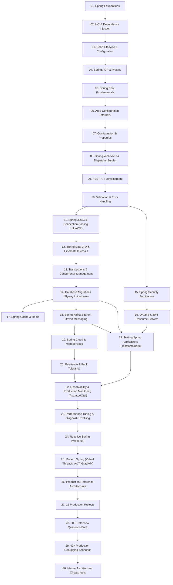

# Spring Boot Learning & Module Dependency Graph

> **Curriculum**: `spring-boot-interview-preparation`
> **Total Modules**: 30
> **Target Mastery**: SDE2, Senior Software Engineer, Senior Backend Engineer, Staff AI/Backend Architect

---

## 🗺️ Master Visual Dependency Graph

---

## 🧩 Learning Track Breakdown

### 1. Core Runtime Track (Modules 01–07)
Foundations of the Spring IoC container, reflection, `BeanDefinition`, custom lifecycle post-processors, CGLIB/JDK dynamic proxy mechanics, Spring Boot startup sequencing, and condition evaluation.

### 2. Web & API Track (Modules 08–10)
HTTP request dispatching via `DispatcherServlet`, handler mapping/adapter invocation, argument resolution, Jackson message conversion, Bean Validation, and RFC 7807 Problem Details error handling.

### 3. Data & Persistence Track (Modules 11–14)
HikariCP connection pool acquisition, raw JDBC vs `JdbcTemplate`, Hibernate first-level cache, entity state transitions (Transient/Managed/Detached/Removed), N+1 query mitigations, transaction proxy boundaries, isolation anomaly prevention, and zero-downtime database migrations.

### 4. Security & Identity Track (Modules 15–16)
`SecurityFilterChain` ordering, stateless JWT token authentication, resource server token decoding, role-based method authorization (`@PreAuthorize`), and OAuth2 client flows.

### 5. Distributed Systems & Caching Track (Modules 17–20)
Redis cache-aside patterns, cache stampede prevention, distributed locking, Kafka consumer concurrency, idempotent consumer patterns, dead-letter queues, transaction outbox patterns, and Resilience4j circuit breakers.

### 6. Production Engineering & Testing Track (Modules 21–23)
Comprehensive testing using `@WebMvcTest`, `@DataJpaTest`, and Testcontainers with real PostgreSQL/Kafka instances, Actuator health/metrics, OpenTelemetry distributed tracing, and systematic latency bottleneck diagnosis.

### 7. Modern Spring & Reactive Track (Modules 24–26)
Project Reactor (`Mono`/`Flux`), WebFlux event loops vs Virtual Threads (`Thread.ofVirtual()`), Spring Boot AOT compilation, and modular monolith vs microservice reference designs.

### 8. Projects & Career Mastery Track (Modules 27–30)
12 runnable production reference services, 300+ categorized technical interview questions with deep architectural answers, 40+ production SEV-1 debugging exercises, and comprehensive quick-reference cheatsheets.
