# Spring Boot Interview Preparation: Production Architecture & Systems Mastery

> An implementation-first, deep-dive Spring Boot curriculum engineered for **SDE2, Senior Backend Engineers, Lead Software Engineers, and Staff Systems Architects**.

---

## 🎯 Target Outcome & Engineering Philosophy

> **"A Senior Backend Engineer who deeply understands how Spring works under the hood — capable of designing, implementing, securing, debugging, optimizing, and defending enterprise-scale Spring Boot systems in high-stakes technical interviews."**

This repository teaches Spring from first principles:

```
UNDERSTAND ➔ VISUALIZE ➔ IMPLEMENT ➔ DEBUG ➔ OPTIMIZE ➔ TEST ➔ DEPLOY ➔ EXPLAIN ➔ DEFEND TRADE-OFFS
```

We do **NOT** offer superficial annotation cheat sheets or copy-pasted tutorial code. The focus is on **deep internal mechanics, runtime proxy behavior, connection pooling physics, transactional boundaries, event-driven consistency, and evidence-driven performance tuning**.

---

## 🏛️ Repository Ecosystem Context

This repository is Pillar 4 of a unified 4-repository backend engineering mastery ecosystem:

```mermaid
flowchart LR
    subgraph Pillar1["1. java-interview-preparation"]
        J1["Core Java & Memory Model"]
        J2["JVM / GC & Virtual Threads"]
    end

    subgraph Pillar2["2. backend-engineering"]
        B1["REST & Protocols"]
        B2["Database & Caching Theory"]
        B3["Kafka & Messaging"]
    end

    subgraph Pillar3["3. system-design-interview"]
        S1["Distributed Systems HLD"]
        S2["Scalability & Enterprise Case Studies"]
    end

    subgraph Pillar4["4. spring-boot-interview-preparation (THIS REPOSITORY)"]
        SP1["IoC / DI / Bean Lifecycle"]
        SP2["Spring MVC / DispatcherServlet"]
        SP3["JPA / Hibernate / Transactions"]
        SP4["Spring Security & OAuth2"]
        SP5["Spring Kafka & Redis"]
        SP6["12 Capstones & 300+ Drills"]
    end

    Pillar1 --> Pillar2
    Pillar2 --> Pillar4
    Pillar4 --> Pillar3
```



Detailed ecosystem boundary guidelines are tracked in [`CROSS_REPOSITORY_MAP.md`](./CROSS_REPOSITORY_MAP.md).

---

## 📌 Technology Baseline & Version Matrix

All technical implementations strictly adhere to modern, stable GA releases:

- **Java Runtime**: `Java 21 LTS` (Compiler `<release>21</release>`)
- **Spring Boot**: `3.4.13` (GA)
- **Spring Framework**: `6.2.2` (GA)
- **Spring Security**: `6.4.2` (GA)
- **Spring Data BOM**: `2024.1.2` (GA)
- **Spring Kafka**: `3.3.2` (GA)
- **Spring Cloud**: `2024.0.0` (Moxton GA)
- **Testcontainers**: `1.20.4` (with real PostgreSQL 16 and Apache Kafka 3.9)

Full version tracking and compatibility invariant rules are recorded in [`VERSION_MATRIX.md`](./VERSION_MATRIX.md).

---

## 🧭 The 30 Curriculum Modules

```mermaid
flowchart TD
    subgraph Core["Spring Core & Runtime"]
        M01["01. Spring Foundations"] --> M02["02. IoC & DI Internals"]
        M02 --> M03["03. Bean Lifecycle"] --> M04["04. Spring AOP & Proxies"]
        M04 --> M05["05. Spring Boot Internals"] --> M06["06. Auto-Configuration"]
        M06 --> M07["07. Configuration & Properties"]
    end

    subgraph Web["Web & APIs"]
        M07 --> M08["08. Spring Web MVC"]
        M08 --> M09["09. REST API Design"]
        M09 --> M10["10. Validation & Error Handling"]
    end

    subgraph Data["Database & Transactions"]
        M10 --> M11["11. Spring JDBC & HikariCP"]
        M11 --> M12["12. JPA & Hibernate Internals"]
        M12 --> M13["13. Transactions & Locking"]
        M13 --> M14["14. Database Migrations"]
    end

    subgraph Security["Security & Messaging"]
        M14 --> M15["15. Spring Security"]
        M15 --> M16["16. OAuth2 & JWT"]
        M16 --> M17["17. Spring Cache & Redis"]
        M17 --> M18["18. Spring Kafka & Outbox"]
    end

    subgraph Production["Production Systems & Projects"]
        M18 --> M19["19. Spring Cloud"]
        M19 --> M20["20. Resilience & Fault Tolerance"]
        M20 --> M21["21. Testing & Testcontainers"]
        M21 --> M22["22. Observability & Actuator"]
        M22 --> M23["23. Performance Tuning"]
        M23 --> M24["24. Reactive WebFlux"]
        M24 --> M25["25. Modern Spring"]
        M25 --> M26["26. Production Architecture"]
        M26 --> M27["27. 12 Capstone Projects"]
        M27 --> M28["28. 300+ Interview Questions"]
        M28 --> M29["29. 40+ SEV-1 Debug Scenarios"]
        M29 --> M30["30. Master Cheatsheets"]
    end
```



See [`CURRICULUM.md`](./CURRICULUM.md) for the exhaustive topic-by-topic breakdown and tracking.

---

## 🗄️ Database & Persistence Track Highlights

Database integration is a first-class citizen in this curriculum:
- **HikariCP Pool Physics**: Dynamic connection acquisition algorithms, leak detection thresholds, and mathematical pool sizing.
- **Hibernate & JPA Mechanics**: First-level cache, entity identity, automatic dirty checking, flush modes, and N+1 query elimination.
- **Transaction Coordination**: Proxy-based `@Transactional` interception, propagation semantics (`REQUIRED`, `REQUIRES_NEW`), rollback rules, isolation anomalies, and optimistic locking retries with `@Version`.
- **Eventual Consistency & Messaging**: Transactional Outbox pattern bridging ACID database commits with Apache Kafka event streams.
- **Zero-Downtime Migrations**: Expand/contract database schema evolution using Flyway and Liquibase with strict `ddl-auto: validate`.

---

## 🚀 12 Production Reference Projects (Module 27)

1. **REST CRUD Service**: Validation, RFC 7807 problem details, PostgreSQL JPA, and JdbcTemplate comparison.
2. **Authentication Service**: Stateless JWT tokens, role-based method security, and password hashing.
3. **Product Catalog**: High-throughput read caching, Redis cache-aside, and cache stampede protection.
4. **High-Concurrency Order Service**: Optimistic locking, idempotency keys, and concurrent request race tests.
5. **Transactional Payment Service**: Transactional Outbox pattern, Kafka event publication, and ledger consistency.
6. **Event-Driven Order System**: Kafka consumer groups, dead letter topics (DLT), and exponential retry backoff.
7. **Notification Service**: Asynchronous execution (`@Async`), worker thread pools, and rate limiting.
8. **API Gateway**: Spring Cloud Gateway routing, token bucket rate limiting, and request correlation IDs.
9. **Distributed Job Service**: Scheduled batch tasks, distributed locks with Redis, and execution audit trails.
10. **Production Microservice**: End-to-end service with Actuator, Micrometer, OpenTelemetry tracing, and Docker.
11. **Reactive Service**: Project Reactor WebFlux service benchmarked against Spring MVC with Virtual Threads.
12. **Production Reference Service**: Comprehensive master architecture combining Security, JPA, Redis, Kafka, Outbox, and Testcontainers.

---

## 🔍 The SPRING-DEBUG Troubleshooting Framework

Every production debugging scenario in Module 29 follows the structured **SPRING-DEBUG** process:
- **S** — State the problem symptoms.
- **P** — Pinpoint the Spring architectural layer.
- **R** — Reproduce with a failing test.
- **I** — Inspect runtime lifecycle or proxy state.
- **N** — Narrow to the root cause.
- **G** — Give the code/config fix.
- **D** — Discuss design trade-offs.
- **E** — Explain production operational impact.
- **B** — Benchmark performance recovery.
- **U** — Understand secondary failure modes.
- **G** — Guard against regression with automated tests.

---

## 🧪 Running Builds & Verification Tests

```bash
# Execute unit and mocked-tier tests in any module
mvn test

# Run complete integration test suite with Testcontainers (requires Docker)
mvn verify
```

---

## 🗺️ Master 6-Week Learning Roadmap

Follow our structured 6-week study schedule in [`ROADMAP.md`](./ROADMAP.md) covering theory, code implementation, debugging scenarios, and mock interview drills.

---

## 📄 License & Contribution

- Open-source under the **MIT License** ([`LICENSE`](./LICENSE)).
- Contributions and enhancements are welcome — please review [`CONTRIBUTING.md`](./CONTRIBUTING.md).
