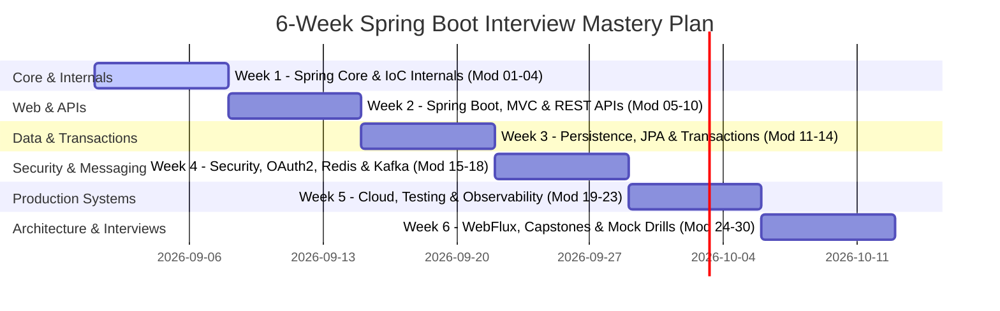

# 6-Week Spring Boot Senior Engineering Mastery Roadmap

> **Target Audience**: SDE2, Senior Backend Engineer, Lead Software Engineer, Staff Systems Architect
> **Weekly Commitment**: 10–15 Hours of Deep Implementation & Architecture Drills

---

## 🗓️ Weekly Schedule & Milestone Breakdown

---

### 📅 Week 1: Spring Core & IoC Container Internals (Modules 01–04)
- **Focus**: `ApplicationContext`, `BeanFactory`, `BeanDefinition`, custom `BeanPostProcessor`, dynamic proxies vs CGLIB, and proxy-based AOP boundaries.
- **Theory**: IoC & DI design philosophy, constructor vs setter vs field injection, circular dependency resolution, and AOP join points.
- **Coding**: Build a mini-IoC container and custom `@Timed` performance logging aspect in Java 21.
- **Debugging**: Diagnose un-injected null beans, circular reference exceptions, and proxy self-invocation bypasses.
- **Interview Q&A**: "How does Spring resolve dependencies at startup?" and "Why does calling a `@Transactional` method from within the same class fail to start a transaction?"

---

### 📅 Week 2: Spring Boot Fundamentals, MVC & REST APIs (Modules 05–10)
- **Focus**: `@SpringBootApplication` startup lifecycle, auto-configuration condition evaluation (`@ConditionalOnMissingBean`), `DispatcherServlet` request processing, Bean Validation, and standardized Problem Details error handling.
- **Theory**: Auto-configuration discovery via `META-INF/spring/org.springframework.boot.autoconfigure.AutoConfiguration.imports`, Jackson message conversion, argument resolvers, and filter vs interceptor lifecycles.
- **Coding**: Build a REST CRUD API with immutable `@ConfigurationProperties`, custom validators, and global `@RestControllerAdvice`.
- **Debugging**: Troubleshoot startup failure diagnostics, auto-configuration precedence conflicts, and validation payload parsing errors.
- **Interview Q&A**: "Walk me through the exact lifecycle of an HTTP request inside Spring MVC from socket to controller."

---

### 📅 Week 3: Database Persistence, Hibernate & Transactions (Modules 11–14)
- **Focus**: HikariCP connection pool mechanics, raw JDBC vs `JdbcTemplate`, Hibernate first-level cache, entity lifecycle states, N+1 query mitigations, transaction propagation (`REQUIRED` vs `REQUIRES_NEW`), isolation levels, optimistic locking (`@Version`), and Flyway zero-downtime migrations.
- **Theory**: Connection acquisition latency, pool sizing math ($Connections = (CoreCount \times 2) + SpindleCount$), dirty checking algorithms, persistence context flush ordering, and the expand/contract database migration pattern.
- **Coding**: Build high-concurrency order persistence with optimistic locking retries, fetch joins, and Flyway migration scripts.
- **Debugging**: Diagnose HikariCP pool exhaustion leaks, `LazyInitializationException`, N+1 queries, deadlocks, and rollback rule violations on checked exceptions.
- **Interview Q&A**: "Why is `save()` not required for managed JPA entities inside `@Transactional`?" and "How does Spring coordinate transactions with the underlying database connection?"

---

### 📅 Week 4: Security, OAuth2, Redis & Event-Driven Kafka (Modules 15–18)
- **Focus**: `SecurityFilterChain` architecture, stateless JWT authentication, OAuth2 Resource Servers, `@Cacheable` Redis cache-aside patterns, cache stampede prevention, distributed locking, Kafka producers/consumers, consumer group rebalancing, and dead-letter queues.
- **Theory**: Filter chain ordering, cryptographic token verification, cache serialization compatibility, Kafka partition assignment, commit offset strategies, and why DB commit + Kafka publish is not an atomic transaction.
- **Coding**: Implement a JWT-secured service with Redis caching and an idempotent Kafka consumer with Dead Letter Topic (DLT) routing.
- **Debugging**: Investigate 403 Forbidden filter chain drop-offs, Redis cache stampedes on expired hot keys, and duplicate Kafka message deliveries.
- **Interview Q&A**: "What is the difference between JWT and OAuth2?" and "How do you implement the Transactional Outbox Pattern in Spring Boot to ensure database-Kafka consistency?"

---

### 📅 Week 5: Microservices, Resilience, Testing & Observability (Modules 19–23)
- **Focus**: Spring Cloud Gateway, Resilience4j circuit breakers & rate limiters, comprehensive testing with Testcontainers (real PostgreSQL and Kafka), Spring Boot Actuator, Micrometer metrics, OpenTelemetry distributed tracing, and evidence-driven performance tuning.
- **Theory**: Circuit breaker state transitions (Closed -> Open -> Half-Open), Testcontainers vs in-memory H2 divergence, Golden Signals monitoring, distributed trace context propagation (W3C Trace Context), and latency bottleneck identification.
- **Coding**: Build an automated integration test suite with Testcontainers and instrument OpenTelemetry traces with custom Micrometer timers.
- **Debugging**: Troubleshoot cascade microservice outages, flaky integration tests caused by dirty contexts, and high P99 latency spikes.
- **Interview Q&A**: "Why is testing against H2 dangerous for production PostgreSQL applications?" and "How do you systematically profile and optimize a slow Spring Boot endpoint?"

---

### 📅 Week 6: WebFlux, Modern Spring, Capstone Projects & Mock Drills (Modules 24–30)
- **Focus**: Project Reactor (`Mono`/`Flux`), WebFlux event loops vs Java 21 Virtual Threads, Spring Boot AOT / GraalVM, 12 production capstone services, 300+ technical interview questions, 40+ SEV-1 debugging scenarios, and master cheatsheets.
- **Theory**: Reactive backpressure, event-loop thread starvation, when to choose WebFlux vs Spring MVC with Virtual Threads, and enterprise modular monolith vs microservice trade-offs.
- **Coding**: Complete end-to-end production reference service integrating Security, JPA, Redis, Kafka, Outbox, Actuator, and Testcontainers.
- **Debugging**: Resolve blocking calls inside reactive pipelines, memory leaks, and production outage post-mortems using the **SPRING-DEBUG** framework.
- **Interview Q&A**: Conduct full mock interviews across all 30 curriculum domains using Bar-Raiser evaluation scorecards.
