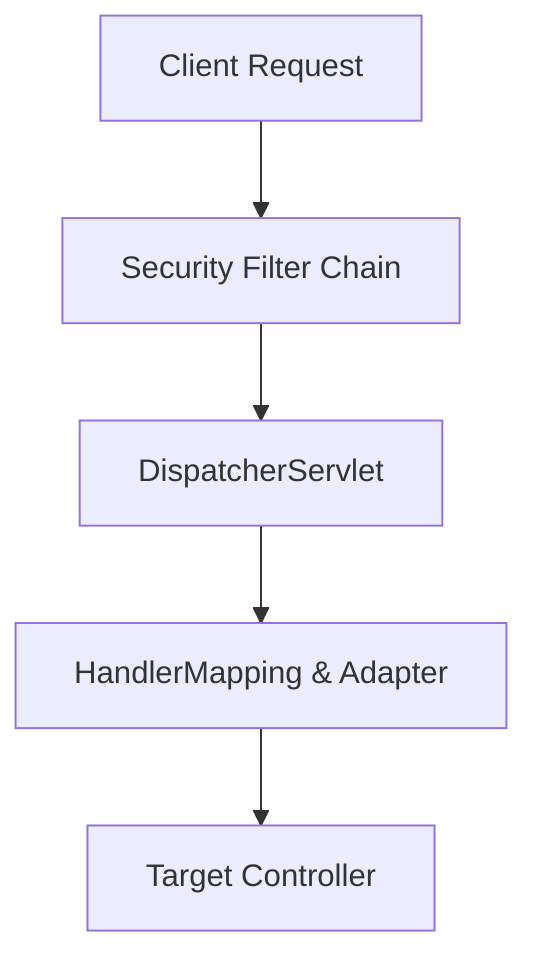

# [Module ID]-[Topic Number]: [Topic Title]

> **Module**: `MOD-[XX]: [Module Name]`
> **Topic ID**: `SB-[XX]-[YY]`
> **Prerequisites**: `SB-[AA]-[BB]`
> **Primary Technology**: Java 21 LTS | Spring Boot 3.4.13 | Spring Framework 6.2.2
> **Verification Date**: 2026-09-01

---

## 1. Problem
*Describe the exact software engineering problem or architectural challenge this concept addresses.*

---

## 2. Why It Exists
*Explain why naive approaches fail and why the Spring ecosystem introduced this abstraction.*

---

## 3. Mental Model
*Provide a clean, intuitive mental model (e.g., virtual memory vs PagedAttention, interceptor pipelines vs filter chains).*

---

## 4. Architecture
*Include a clean, valid Mermaid diagram showing the component relationships, state transitions, or lifecycle flow.*



---

## 5. How Spring Implements It
*Explain the deep internal mechanics: reflection, bytecode proxies, BeanPostProcessors, or database connection management.*

---

## 6. Minimal Example
*A minimal, self-contained Java 21 code snippet demonstrating the core concept.*

```java
package com.example.demo;

import org.springframework.stereotype.Service;

@Service
public class MinimalService {
    public String execute() {
        return "Hello Spring!";
    }
}
```

---

## 7. Production Example
*A production-grade implementation with error handling, logging, validation, and immutability.*

```java
package com.example.demo;

import org.springframework.stereotype.Service;
import java.util.Objects;

@Service
public class ProductionService {
    public record Result(String id, String payload) {}

    public Result process(String input) {
        Objects.requireNonNull(input, "input must not be null");
        return new Result("id-123", input.trim());
    }
}
```

---

## 8. Internal Execution Flow
*Step-by-step trace of what happens at runtime under the hood.*

---

## 9. Common Mistakes
- **Mistake 1**: *Description and why it fails.*
- **Mistake 2**: *Description and why it fails.*

---

## 10. Debugging
*Explain how to identify and resolve failures when this mechanism breaks in production using the SPRING-DEBUG framework.*

---

## 11. Performance
*Explain memory, CPU, connection pooling, and latency implications.*

---

## 12. Testing
*Provide both unit test slices and realistic integration tests using Testcontainers.*

```java
@Test
void shouldDemonstrateExpectedBehavior() {
    // Unit or Integration Test
}
```

---

## 13. Security Considerations
*Address authentication, authorization, secret management, injection prevention, and data exposure.*

---

## 14. Alternatives
*Compare Spring's approach with alternatives (e.g. Micronaut, Quarkus, pure Jakarta EE).*

---

## 15. Trade-offs
| Attribute | Spring Mechanism | Alternative Approach |
|---|---|---|
| **Complexity** | High / Low | Low / High |
| **Performance** | High / Low | Low / High |

---

## 16. Interview Questions
1. *Senior-level interview question 1*
2. *Senior-level interview question 2*

---

## 17. Interview Answer
*Structured, high-signal response suitable for SDE2, Senior, or Staff interviews.*

---

## 18. Hands-on Exercise
*A concrete coding drill for the learner to implement and verify.*

---

## 19. Expected Learning
*Summary of core takeaways and mastery outcomes.*

---

## 20. Further Reading
- [Official Spring Documentation](https://spring.io/projects/spring-boot)
- Related repo lessons and cross-references.
